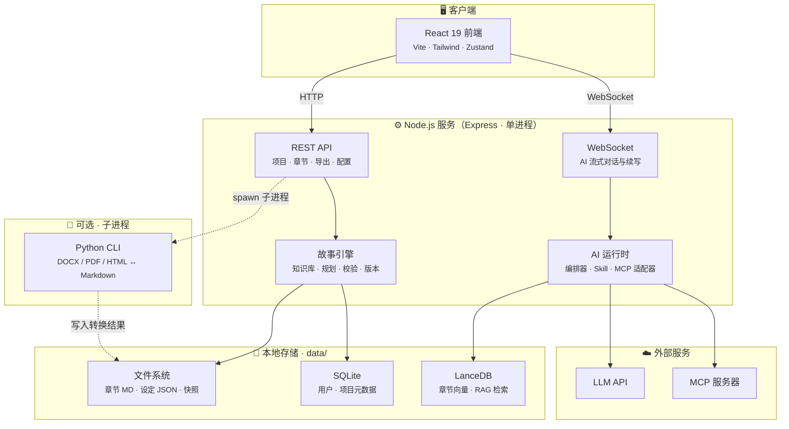
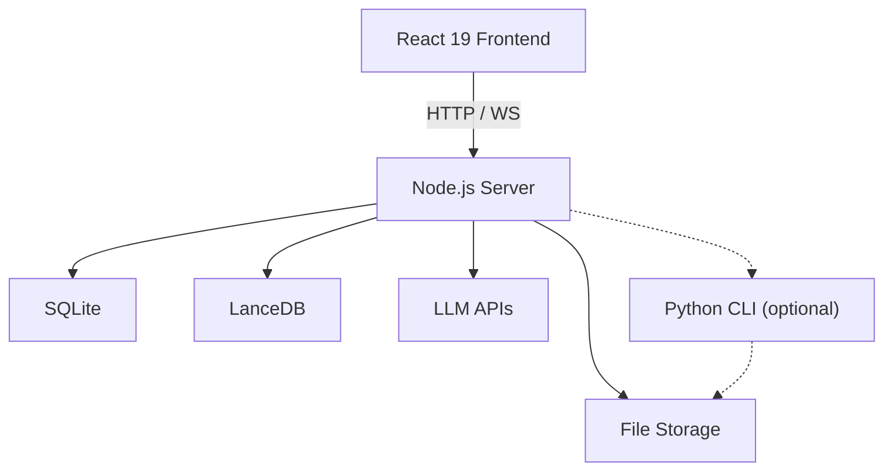

# 文匠 Studio / Literary Studio

<div align="center">

**编剧级 AI 创作工作台 — 面向网文、长篇叙事与剧本的专业写作平台**

*Screenplay-grade AI writing workspace for web novels, long-form narrative, and screenplays*

[中文](#中文) · [English](#english)


</div>

---

<a id="中文"></a>

## 目录

- [项目是什么](#项目是什么)
- [解决什么问题](#解决什么问题)
- [核心功能](#核心功能)
- [技术架构](#技术架构)
- [快速开始](#快速开始)
- [安装与部署](#安装与部署)
- [使用指南](#使用指南)
- [环境变量参考](#环境变量参考)
- [项目结构](#项目结构)
- [故障排查](#故障排查)
- [贡献指南](#贡献指南)
- [许可证](#许可证)

---

## 项目是什么

**文匠 Studio**（Literary Studio）是一款面向叙事创作者的 **本地优先（Local-first）AI 写作工作台**。它将 Markdown 编辑器、AI 对话引擎、故事知识图谱、创作规划、质量校验、版本管理与多格式导出整合在同一界面中，帮助网文作者、编剧和长篇叙事写作者完成从构思、大纲、成稿到改稿的全流程创作。

与通用 AI 聊天工具不同，文匠 Studio 围绕**长篇叙事**的特有需求设计：

- 章节级工作区与自动保存
- 跨章节的人物、伏笔、时间线一致性管理
- 基于向量检索（RAG）的上下文感知续写
- 内嵌 **literary-writer** 技能包，提供网文写章、大纲规划、审稿等专业工作流
- 支持剧本格式（AWR 规则）与 Fountain 导出

> 产品定位：**编剧级创作台** — 为叙事创作者打磨每一稿。

---

## 解决什么问题

长篇创作在使用通用 AI 工具时，普遍面临以下痛点。文匠 Studio 针对这些问题提供了系统化解决方案：

| 痛点 | 文匠 Studio 的解法 |
|------|-------------------|
| AI 缺乏长篇记忆，续写容易「跑偏」 | LanceDB 向量检索 + 故事知识库，对话与续写时自动注入相关章节、角色与伏笔上下文 |
| 人物设定、伏笔、时间线难以追踪 | 自动提取并结构化存储角色、关系、时间线、伏笔、地点，提供可视化知识图谱 |
| 创作进度混乱，缺乏规划 | 故事规划器：章节路线图、写作任务调度、今日建议、目标追踪 |
| 改稿后难以回退 | 章节级版本快照，支持差异对比与一键回滚 |
| 多工具切换（编辑器、笔记、AI、导出）效率低 | 统一工作台：编辑、对话、审稿、导出在同一项目内完成 |
| AI 能力难以扩展 | AI 中心支持多模型配置、Skill 技能包、MCP（Model Context Protocol）服务器接入 |
| 稿件格式多样，导入导出麻烦 | 支持 DOCX / PDF / HTML 导入，ZIP / DOCX / EPUB / Fountain 导出 |
| 本地数据安全与隐私 | 数据默认存储在本地 `data/` 目录，API 密钥仅存本机，无需上传云端 |

---

## 核心功能

### 创作工作台

| 模块 | 说明 |
|------|------|
| **智能写作工作台** | Markdown 编辑器 + AI 对话侧栏；焦点模式、自动保存、章节树导航 |
| **AI 续写与改写** | WebSocket 流式生成；支持续写、扩写、润色、改写；总编辑代理按意图自动路由 |
| **多会话管理** | 项目内多对话会话，支持焦点会话与上下文记忆 |
| **文档导入** | 上传 DOCX / PDF / HTML，自动转换为 Markdown 章节 |
| **多格式导出** | 单章或整书导出为 ZIP、DOCX、EPUB、Fountain |

### 故事引擎

| 模块 | 说明 |
|------|------|
| **故事知识库** | 角色、关系、时间线、伏笔、地点的结构化存储与可视化 |
| **作品圣经（Bible）** | 世界观、设定集、核心冲突等创作约束文档 |
| **节拍与悬念** | 故事节拍（Beats）规划、悬念线追踪 |
| **RAG 语义检索** | 基于 LanceDB 向量库，AI 对话时检索最相关章节片段 |
| **故事规划器** | 章节路线图、创作任务、今日建议、目标进度 |
| **健康度仪表盘** | 故事 DNA 分析、冲突追踪、角色弧线、质量评分（6 维度） |
| **写后校验** | 一致性检查、伏笔回收、字数阈值等自动质量指标 |

### 协作与治理

| 模块 | 说明 |
|------|------|
| **创作看板** | 全局数据一览：各项目改稿章节数、改动字数、近 7 日趋势 |
| **审稿中心** | 跨项目选稿审稿：规则引擎 + Governor 决策 + 启发式正文分析 |
| **项目版本** | 大改前创建快照，对比差异，一键回滚 |
| **素材中心** | 跨项目角色卡、地点、灵感碎片备忘 |
| **项目共享** | 多用户项目协作与权限控制（管理员可管理用户） |
| **留言板** | 内置反馈系统，支持图文与多层回复 |

### 剧本引擎

| 模块 | 说明 |
|------|------|
| **专业剧本格式** | 遵循 AWR 规则的场景/对白排版 |
| **结构管理** | 分集、场景、分镜层级管理 |
| **Fountain 导出** | 行业标准剧本交换格式 |

### AI 中心

| 模块 | 说明 |
|------|------|
| **多模型支持** | OpenAI / Anthropic / DeepSeek / Gemini 等兼容 API；支持 CC-Switch 导入 |
| **Skill 技能包** | 内嵌 literary-writer（v7.0），含网文初始化、规划、写章、审稿等子技能 |
| **MCP 集成** | Model Context Protocol 服务器发现、安装、调用与健康检查 |
| **工作流引擎** | 多步骤技能工作流（如角色塑造大师、大纲结构大师） |

---

## 技术架构

### 系统拓扑

文匠 Studio 采用 **单 Node 进程 + 本地存储** 架构。前端构建为静态资源，由 Node 后端统一托管；Python 仅作为可选子进程，在需要时由 Node 调用，并非独立运行的后端服务。



### 创作流水线（Story OS）

故事相关功能按 **状态驱动** 组织，从文稿扫描到 AI 执行形成清晰链路：


### 关键设计说明

| 设计点 | 说明 |
|--------|------|
| **单进程部署** | 一个 Node 进程同时提供 API、WebSocket 和静态前端，无需额外反向代理即可本地使用 |
| **本地优先** | 所有项目数据写入 `data/` 目录，备份该目录即可迁移全部内容 |
| **Python 的角色** | 非独立后端；Node 在导入 DOCX/PDF 等格式时 `spawn` 调用 `backend/convert_cli.py`，未安装 Python 时核心功能仍可用 |
| **RAG 检索** | 章节保存后，事件总线触发向量索引更新；AI 对话时从 LanceDB 检索相关片段注入上下文 |
| **技能包** | 内嵌 `skills/literary-writer`，启动时自动绑定，无需安装到 `~/.cursor/skills` |

---

## 快速开始

**环境要求：** Node.js 22+、npm；Windows 10+ / macOS 12+ / Linux。Python 3.9+ 为可选（文档转换）。

```bash
git clone https://github.com/Marcus9593/literary-studio.git
cd literary-studio
npm start
```

浏览器访问 **http://127.0.0.1:8765**，默认账号 `admin` / `admin123`。

> 分平台安装步骤、生产部署、环境变量与故障排查，请参阅 **[`deploy/README.md`](deploy/README.md)**。

---

## 安装与部署

Windows / macOS / Linux 的**完整安装步骤**（前置依赖、克隆、配置、启动、验证）、**生产环境部署**（systemd / launchd / Windows 服务）、环境变量说明与故障排查，均见：

**[`deploy/README.md`](deploy/README.md)**

同目录还提供 `literary-studio.service`、`literary-studio-macos.plist`、`nginx-literary-studio.conf` 等配置模板。

---

## 使用指南

### 首次配置

1. 使用默认账号登录后，进入 **AI 中心 → 模型**，配置你的 LLM API（OpenAI 兼容或 Anthropic 兼容）
2. 在 **AI 中心 → 技能** 确认默认技能为 `literary-writer`（通常已自动绑定）
3. 可选：在 **AI 中心 → MCP** 接入外部工具服务器

### 创建项目

1. 侧栏进入 **项目库** → 点击「创建项目」
2. 选择项目类型（网文 / 剧本 / 长篇叙事）
3. 可直接导入已有 DOCX 文稿，或从空白项目开始

### 日常创作流程

```
创建项目 → 编写大纲/设定 → 进入工作台写章
    ↓
AI 侧栏对话（续写/润色/改写）→ 自动保存
    ↓
故事知识库自动更新 → 健康度/校验检查
    ↓
版本快照（大改前）→ 导出 DOCX/EPUB/Fountain
```

### 主要界面导航

| 侧栏入口 | 功能 |
|----------|------|
| **创作看板** | 全局创作数据统计 |
| **项目库** | 项目列表与创建 |
| **审稿中心** | 跨项目批量审稿 |
| **素材中心** | 跨项目灵感与角色备忘 |
| **项目版本** | 快照管理与回滚 |
| **AI 中心** | 模型 / 技能 / MCP 配置 |
| **留言板** | 产品反馈 |

进入具体项目后，右侧导航可访问：工作台、今日建议、节拍、角色、圣经、悬念、知识库、规划、路线图、健康度、故事引擎等子模块。

### literary-writer 技能包

工程内已内嵌完整 literary-writer 技能（`skills/literary-writer/`），支持：

- **webnovel-init** — 初始化新网文项目
- **webnovel-plan** — 规划大纲、拆卷拆章
- **webnovel-write** — 完整写章流程（上下文→起草→审查→润色→提交）
- **webnovel-review** — 结构化审稿报告
- **webnovel-query** — 查询设定、角色、伏笔

若在外部目录维护主副本，可同步到工程：

```bash
node scripts/sync-literary-writer.mjs
# 或指定路径
node scripts/sync-literary-writer.mjs "D:\path\to\literary-writer"
```

---

## 环境变量参考

在项目根目录创建 `.env` 文件（参考 `.env.example`）。常用变量包括 `PORT`、`STUDIO_HOST`、`STUDIO_ADMIN_*`、`STUDIO_JWT_SECRET`、`STUDIO_PRODUCTION`、`LITERARY_STUDIO_DATA` 等。

完整说明见 **[`deploy/README.md` — 环境变量参考](deploy/README.md#环境变量参考)**。

---

## 项目结构

```
literary-studio/
├── frontend/                 # React 19 前端
│   ├── src/
│   │   ├── api.js            # REST API 客户端
│   │   ├── App.jsx           # 路由与布局
│   │   ├── components/       # 通用组件
│   │   ├── features/         # 功能模块（AI 中心、审稿、版本、剧本等）
│   │   ├── pages/            # 页面（项目库、故事引擎各子页）
│   │   ├── stores/           # Zustand 状态管理
│   │   └── services/         # WebSocket 服务
│   └── package.json
├── backend-node/             # Node.js 主后端
│   ├── server.js             # 入口
│   ├── routes.js             # API 路由（67+ 端点）
│   ├── auth/                 # JWT 认证
│   ├── ai-runtime/           # AI 编排器与多模型提供商
│   ├── agents/               # 总编辑代理等
│   ├── event-bus/            # 事件总线
│   ├── memory/               # LanceDB 向量检索（RAG）
│   ├── storage/              # 文件 + SQLite 存储层
│   ├── story-kb/             # 故事知识库
│   ├── workflow/             # 多步骤工作流引擎
│   └── package.json
├── backend/                  # Python 后端（可选 · 文档处理）
│   ├── main.py               # FastAPI 入口
│   ├── document_convert.py   # 文档导入转换
│   ├── document_export.py    # 文档导出
│   └── requirements.txt
├── skills/                   # AI 技能包
│   └── literary-writer/      # 网文/剧本创作技能（v7.0）
├── deploy/                   # 部署配置（systemd / launchd / Nginx）
├── test/                     # Python API 集成测试（pytest）
├── scripts/                  # 启动与构建脚本
│   ├── start.mjs             # 跨平台启动
│   └── build.mjs             # 前端构建
├── data/                     # 运行时数据（不提交 Git）
├── start.bat / start.sh / start.ps1
├── .env.example
└── LICENSE
```

---

## 故障排查

常见问题（端口占用、页面空白、Node 版本、AI 无响应、文档导入等）见 **[`deploy/README.md` — 故障排查](deploy/README.md#故障排查)**。

---

## 贡献指南

欢迎贡献代码、文档与反馈！

1. Fork 本仓库
2. 创建功能分支：`git checkout -b feature/your-feature`
3. 提交更改：`git commit -m 'feat: describe your change'`
4. 推送分支：`git push origin feature/your-feature`
5. 提交 Pull Request

---

## 许可证

本项目基于 [MIT 许可证](LICENSE) 开源。

---

<a id="english"></a>

## English

### What is Literary Studio?

**Literary Studio** is a **local-first AI writing workspace** for narrative creators — web novelists, screenwriters, and long-form fiction authors. It unifies a Markdown editor, AI chat engine, story knowledge graph, planning tools, quality verification, version control, and multi-format export in a single interface.

Unlike generic AI chat tools, Literary Studio is purpose-built for **long-form narrative**:

- Chapter-level workspaces with auto-save
- Cross-chapter consistency for characters, foreshadowing, and timelines
- RAG-powered context-aware continuation via LanceDB
- Embedded **literary-writer** skill pack for professional web-novel workflows
- Screenplay format support (AWR rules) and Fountain export

### Problems It Solves

| Pain Point | Solution |
|------------|----------|
| AI loses context in long works | LanceDB vector search + story knowledge base auto-injects relevant context |
| Hard to track characters, foreshadowing, timelines | Structured extraction and visualization of story elements |
| Disorganized creative progress | Story planner with roadmaps, tasks, and daily suggestions |
| No rollback after major edits | Chapter-level version snapshots with diff and restore |
| Tool fragmentation | Unified workspace: edit, chat, review, and export in one project |
| Limited AI extensibility | AI Center with multi-model config, Skills, and MCP integration |
| Format conversion headaches | Import DOCX/PDF/HTML; export ZIP/DOCX/EPUB/Fountain |
| Data privacy concerns | All data stored locally in `data/`; API keys never leave your machine |

### Key Features

- **Smart Writing Workspace** — Markdown editor + AI sidebar, focus mode, auto-save
- **AI Writing & Editing** — WebSocket streaming for continuation, expansion, polishing, rewriting
- **Story Knowledge Base** — Characters, relationships, timeline, foreshadowing, locations
- **RAG Semantic Search** — LanceDB vector store for context-aware conversations
- **Story Planner** — Chapter roadmaps, task scheduling, daily suggestions, goal tracking
- **Post-Write Verification** — Consistency, foreshadowing recovery, word-count checks
- **Health Dashboard** — Story DNA, conflict tracking, character arcs, 6-dimension quality scoring
- **Screenplay Engine** — AWR format, scenes/episodes/shots, Fountain export
- **Version Control** — Snapshots with diff and rollback
- **Review Center** — Cross-project review with rule engine and heuristic analysis
- **AI Center** — Multi-model support, literary-writer skills, MCP servers
- **Guestbook** — Built-in feedback with image upload

### Architecture

Single Node.js process serves API, WebSocket, and static frontend. Python runs as an optional subprocess for document conversion — not a separate backend.



### Requirements

| Component | Version | Required |
|-----------|---------|----------|
| Node.js | **22+** | Yes |
| npm / pnpm | Latest | Yes |
| OS | Windows 10+, macOS 12+, Linux | Yes |
| Python | 3.9+ | Optional |

### Quick Start

```bash
git clone https://github.com/Marcus9593/literary-studio.git
cd literary-studio
npm start
```

Open **http://127.0.0.1:8765** — login with `admin` / `admin123`.

> ⚠️ Change the default password and JWT secret before any production use!

**Development mode (hot reload):**

```bash
# Terminal 1
npm start

# Terminal 2
npm run frontend:dev
```

### Installation & Deployment

Cross-platform installation, production deployment (systemd / launchd / Windows service), environment variables, and troubleshooting: **[`deploy/README.md`](deploy/README.md)**.

### Project Structure

```
literary-studio/
├── frontend/          # React frontend
├── backend-node/      # Node.js primary backend
├── backend/           # Python document processing (optional)
├── skills/            # AI skill packs (literary-writer)
├── deploy/            # Deployment configs
├── scripts/           # Start & build scripts
└── data/              # Runtime data (not committed)
```

### Troubleshooting

See **[`deploy/README.md` — Troubleshooting](deploy/README.md#故障排查)**.

### Contributing

1. Fork the repository
2. Create a feature branch
3. Commit and push
4. Open a Pull Request

### License

[MIT License](LICENSE)
