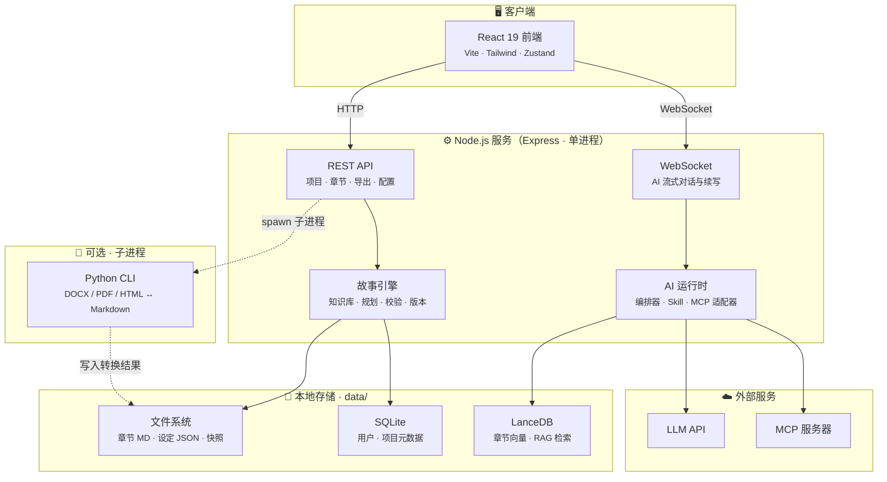
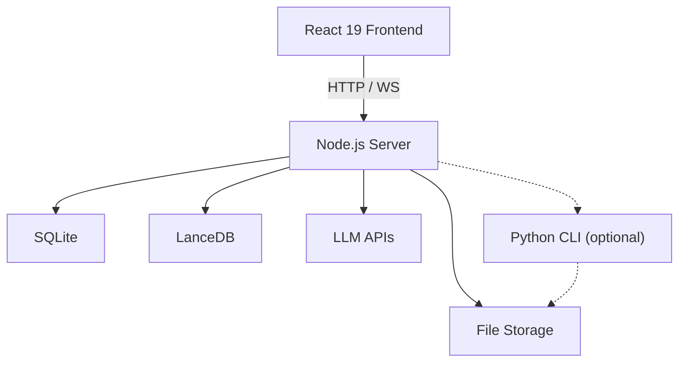

# 文匠 Studio / Literary Studio

<div align="center">

**编剧级 AI 创作工作台 — 面向网文、长篇叙事与剧本的专业写作平台**

*Screenplay-grade AI writing workspace for web novels, long-form narrative, and screenplays*

[中文](#中文) · [English](#english)


</div>

---

<a id="中文"></a>

## 目录

- [项目是什么](#项目是什么)
- [解决什么问题](#解决什么问题)
- [核心功能](#核心功能)
- [技术架构](#技术架构)
- [环境要求](#环境要求)
- [快速开始](#快速开始)
- [使用指南](#使用指南)
- [详细安装与部署指南](#详细安装与部署指南)
  - [前置依赖总览](#前置依赖总览)
  - [Windows 安装与启动](#windows-安装与启动)
  - [macOS 安装与启动](#macos-安装与启动)
  - [Linux 安装与启动](#linux-安装与启动)
  - [首次登录与验证](#首次登录与验证)
  - [开发模式与可选组件](#开发模式与可选组件)
- [生产环境部署](#生产环境部署)
- [环境变量参考](#环境变量参考)
- [项目结构](#项目结构)
- [故障排查](#故障排查)
- [贡献指南](#贡献指南)
- [许可证](#许可证)

---

## 项目是什么

**文匠 Studio**（Literary Studio）是一款面向叙事创作者的 **本地优先（Local-first）AI 写作工作台**。它将 Markdown 编辑器、AI 对话引擎、故事知识图谱、创作规划、质量校验、版本管理与多格式导出整合在同一界面中，帮助网文作者、编剧和长篇叙事写作者完成从构思、大纲、成稿到改稿的全流程创作。

与通用 AI 聊天工具不同，文匠 Studio 围绕**长篇叙事**的特有需求设计：

- 章节级工作区与自动保存
- 跨章节的人物、伏笔、时间线一致性管理
- 基于向量检索（RAG）的上下文感知续写
- 内嵌 **literary-writer** 技能包，提供网文写章、大纲规划、审稿等专业工作流
- 支持剧本格式（AWR 规则）与 Fountain 导出

> 产品定位：**编剧级创作台** — 为叙事创作者打磨每一稿。

---

## 解决什么问题

长篇创作在使用通用 AI 工具时，普遍面临以下痛点。文匠 Studio 针对这些问题提供了系统化解决方案：

| 痛点 | 文匠 Studio 的解法 |
|------|-------------------|
| AI 缺乏长篇记忆，续写容易「跑偏」 | LanceDB 向量检索 + 故事知识库，对话与续写时自动注入相关章节、角色与伏笔上下文 |
| 人物设定、伏笔、时间线难以追踪 | 自动提取并结构化存储角色、关系、时间线、伏笔、地点，提供可视化知识图谱 |
| 创作进度混乱，缺乏规划 | 故事规划器：章节路线图、写作任务调度、今日建议、目标追踪 |
| 改稿后难以回退 | 章节级版本快照，支持差异对比与一键回滚 |
| 多工具切换（编辑器、笔记、AI、导出）效率低 | 统一工作台：编辑、对话、审稿、导出在同一项目内完成 |
| AI 能力难以扩展 | AI 中心支持多模型配置、Skill 技能包、MCP（Model Context Protocol）服务器接入 |
| 稿件格式多样，导入导出麻烦 | 支持 DOCX / PDF / HTML 导入，ZIP / DOCX / EPUB / Fountain 导出 |
| 本地数据安全与隐私 | 数据默认存储在本地 `data/` 目录，API 密钥仅存本机，无需上传云端 |

---

## 核心功能

### 创作工作台

| 模块 | 说明 |
|------|------|
| **智能写作工作台** | Markdown 编辑器 + AI 对话侧栏；焦点模式、自动保存、章节树导航 |
| **AI 续写与改写** | WebSocket 流式生成；支持续写、扩写、润色、改写；总编辑代理按意图自动路由 |
| **多会话管理** | 项目内多对话会话，支持焦点会话与上下文记忆 |
| **文档导入** | 上传 DOCX / PDF / HTML，自动转换为 Markdown 章节 |
| **多格式导出** | 单章或整书导出为 ZIP、DOCX、EPUB、Fountain |

### 故事引擎

| 模块 | 说明 |
|------|------|
| **故事知识库** | 角色、关系、时间线、伏笔、地点的结构化存储与可视化 |
| **作品圣经（Bible）** | 世界观、设定集、核心冲突等创作约束文档 |
| **节拍与悬念** | 故事节拍（Beats）规划、悬念线追踪 |
| **RAG 语义检索** | 基于 LanceDB 向量库，AI 对话时检索最相关章节片段 |
| **故事规划器** | 章节路线图、创作任务、今日建议、目标进度 |
| **健康度仪表盘** | 故事 DNA 分析、冲突追踪、角色弧线、质量评分（6 维度） |
| **写后校验** | 一致性检查、伏笔回收、字数阈值等自动质量指标 |

### 协作与治理

| 模块 | 说明 |
|------|------|
| **创作看板** | 全局数据一览：各项目改稿章节数、改动字数、近 7 日趋势 |
| **审稿中心** | 跨项目选稿审稿：规则引擎 + Governor 决策 + 启发式正文分析 |
| **项目版本** | 大改前创建快照，对比差异，一键回滚 |
| **素材中心** | 跨项目角色卡、地点、灵感碎片备忘 |
| **项目共享** | 多用户项目协作与权限控制（管理员可管理用户） |
| **留言板** | 内置反馈系统，支持图文与多层回复 |

### 剧本引擎

| 模块 | 说明 |
|------|------|
| **专业剧本格式** | 遵循 AWR 规则的场景/对白排版 |
| **结构管理** | 分集、场景、分镜层级管理 |
| **Fountain 导出** | 行业标准剧本交换格式 |

### AI 中心

| 模块 | 说明 |
|------|------|
| **多模型支持** | OpenAI / Anthropic / DeepSeek / Gemini 等兼容 API；支持 CC-Switch 导入 |
| **Skill 技能包** | 内嵌 literary-writer（v7.0），含网文初始化、规划、写章、审稿等子技能 |
| **MCP 集成** | Model Context Protocol 服务器发现、安装、调用与健康检查 |
| **工作流引擎** | 多步骤技能工作流（如角色塑造大师、大纲结构大师） |

---

## 技术架构

### 系统拓扑

文匠 Studio 采用 **单 Node 进程 + 本地存储** 架构。前端构建为静态资源，由 Node 后端统一托管；Python 仅作为可选子进程，在需要时由 Node 调用，并非独立运行的后端服务。



### 创作流水线（Story OS）

故事相关功能按 **状态驱动** 组织，从文稿扫描到 AI 执行形成清晰链路：


### 关键设计说明

| 设计点 | 说明 |
|--------|------|
| **单进程部署** | 一个 Node 进程同时提供 API、WebSocket 和静态前端，无需额外反向代理即可本地使用 |
| **本地优先** | 所有项目数据写入 `data/` 目录，备份该目录即可迁移全部内容 |
| **Python 的角色** | 非独立后端；Node 在导入 DOCX/PDF 等格式时 `spawn` 调用 `backend/convert_cli.py`，未安装 Python 时核心功能仍可用 |
| **RAG 检索** | 章节保存后，事件总线触发向量索引更新；AI 对话时从 LanceDB 检索相关片段注入上下文 |
| **技能包** | 内嵌 `skills/literary-writer`，启动时自动绑定，无需安装到 `~/.cursor/skills` |

---

## 环境要求

| 组件 | 要求 | 必需 |
|------|------|------|
| **Node.js** | **22 及以上**（`node -v` 验证） | ✅ 必需 |
| **npm** | 随 Node.js 附带，或使用 pnpm | ✅ 必需 |
| **操作系统** | Windows 10+、macOS 12+、Linux（glibc 系） | ✅ 必需 |
| **Python** | 3.9 及以上 | ⬜ 可选（文档转换增强、webnovel CLI） |
| **反向代理** | Nginx / Caddy / IIS | ⬜ 公网部署时推荐 |

---

## 快速开始

> 需要 **Windows / macOS / Linux 分平台详细步骤**（含依赖安装与启动验证）？请直接阅读 [详细安装与部署指南](#详细安装与部署指南)。

### 1. 获取代码

```bash
git clone https://github.com/Marcus9593/literary-studio.git
cd literary-studio
```

### 2. 一键启动（推荐）

项目根目录提供跨平台启动脚本，会自动检查 Node 版本、安装依赖、构建前端并启动服务：

```bash
npm start
```

| 平台 | 等效命令 |
|------|----------|
| **任意平台** | `node scripts/start.mjs` |
| **Windows** | 双击 `start.bat`，或 `.\start.ps1` |
| **macOS / Linux** | `chmod +x start.sh && ./start.sh` |

启动完成后，浏览器访问：**http://127.0.0.1:8765**

默认登录账号：`admin` / `admin123`

> ⚠️ **首次使用前请务必修改默认密码和 JWT Secret！**（见[环境变量参考](#环境变量参考)）

### 3. 开发模式（前端热更新）

需要修改前端代码时，使用双终端模式：

```bash
# 终端 1：启动后端（含静态资源服务）
npm start

# 终端 2：启动 Vite 开发服务器
npm run frontend:dev
# 浏览器打开 Vite 提示的地址（通常 http://localhost:5173）
# API 请求仍走后端 8765 端口
```

### 4. 仅构建前端

```bash
npm run build
# 或 node scripts/build.mjs
```

构建产物输出至 `frontend/dist/`，由 Node 后端统一托管。

### 5. 可选：Python 依赖

文档转换与 webnovel CLI 完整能力需要 Python：

```bash
# 主 Python 后端（文档处理）
cd backend
pip install -r requirements.txt
cd ..

# literary-writer 技能包 CLI 增强
cd skills/literary-writer/scripts
pip install -r requirements.txt
cd ../../..
```

未安装 Python 时，Studio 核心功能（编辑、AI 对话、故事引擎）仍可正常使用；部分文档转换与 CLI 增强功能可能不可用。

---

## 使用指南

### 首次配置

1. 使用默认账号登录后，进入 **AI 中心 → 模型**，配置你的 LLM API（OpenAI 兼容或 Anthropic 兼容）
2. 在 **AI 中心 → 技能** 确认默认技能为 `literary-writer`（通常已自动绑定）
3. 可选：在 **AI 中心 → MCP** 接入外部工具服务器

### 创建项目

1. 侧栏进入 **项目库** → 点击「创建项目」
2. 选择项目类型（网文 / 剧本 / 长篇叙事）
3. 可直接导入已有 DOCX 文稿，或从空白项目开始

### 日常创作流程

```
创建项目 → 编写大纲/设定 → 进入工作台写章
    ↓
AI 侧栏对话（续写/润色/改写）→ 自动保存
    ↓
故事知识库自动更新 → 健康度/校验检查
    ↓
版本快照（大改前）→ 导出 DOCX/EPUB/Fountain
```

### 主要界面导航

| 侧栏入口 | 功能 |
|----------|------|
| **创作看板** | 全局创作数据统计 |
| **项目库** | 项目列表与创建 |
| **审稿中心** | 跨项目批量审稿 |
| **素材中心** | 跨项目灵感与角色备忘 |
| **项目版本** | 快照管理与回滚 |
| **AI 中心** | 模型 / 技能 / MCP 配置 |
| **留言板** | 产品反馈 |

进入具体项目后，右侧导航可访问：工作台、今日建议、节拍、角色、圣经、悬念、知识库、规划、路线图、健康度、故事引擎等子模块。

### literary-writer 技能包

工程内已内嵌完整 literary-writer 技能（`skills/literary-writer/`），支持：

- **webnovel-init** — 初始化新网文项目
- **webnovel-plan** — 规划大纲、拆卷拆章
- **webnovel-write** — 完整写章流程（上下文→起草→审查→润色→提交）
- **webnovel-review** — 结构化审稿报告
- **webnovel-query** — 查询设定、角色、伏笔

若在外部目录维护主副本，可同步到工程：

```bash
node scripts/sync-literary-writer.mjs
# 或指定路径
node scripts/sync-literary-writer.mjs "D:\path\to\literary-writer"
```

---

## 详细安装与部署指南

本节是**从零到可运行**的完整安装文档，覆盖 **Windows / macOS / Linux** 三个平台：如何安装前置依赖、如何获取代码、如何启动服务，以及安装后如何验证。

> 若你只想最快跑起来，可先阅读上文 [快速开始](#快速开始)；本节适合首次部署、换机迁移或生产环境规划时查阅。

---

### 前置依赖总览

| 组件 | 版本要求 | 是否必需 | 用途 |
|------|----------|----------|------|
| **Node.js** | **22 及以上** | ✅ 必需 | 主后端、前端构建、一键启动脚本 |
| **npm** | 随 Node 附带 | ✅ 必需 | 安装 `backend-node` / `frontend` 依赖 |
| **Git** | 任意较新版本 | ✅ 推荐 | 克隆仓库、后续更新 |
| **Python** | 3.9 及以上 | ⬜ 可选 | DOCX / PDF / HTML 文档导入转换、literary-writer CLI 增强 |
| **C++ 构建工具** | — | ⬜ Linux 常见需要 | 编译 LanceDB 等原生 Node 模块（见各平台说明） |

**验证命令（三平台通用）：**

```bash
node -v    # 应显示 v22.x 或更高
npm -v     # 应显示 10.x 或更高
git --version
python3 --version   # 可选
```

**默认访问地址：** http://127.0.0.1:8765  
**默认管理员账号：** `admin` / `admin123`（首次登录后请立即修改，见 [环境变量参考](#环境变量参考)）

---

### Windows 安装与启动

#### 1. 安装 Node.js 22+

任选一种方式：

**方式 A — 官方安装包（推荐新手）**

1. 打开 https://nodejs.org/
2. 下载 **Current** 或 **LTS（22+）** Windows 安装包（`.msi`）
3. 安装时勾选 **Add to PATH**
4. 重新打开 PowerShell / CMD，执行 `node -v` 确认版本 ≥ 22

**方式 B — winget**

```powershell
winget install OpenJS.NodeJS
node -v
```

**方式 C — nvm-windows（适合多版本切换）**

1. 安装 [nvm-windows](https://github.com/coreybutler/nvm-windows/releases)
2. 执行：

```powershell
nvm install 22
nvm use 22
node -v
```

#### 2. 安装 Git（若尚未安装）

```powershell
winget install Git.Git
git --version
```

#### 3. 安装 Python（可选 · 文档转换）

1. 打开 https://www.python.org/downloads/windows/
2. 下载 Python 3.11+ 安装包
3. **务必勾选** “Add python.exe to PATH”
4. 验证：`python --version`

安装 Python 依赖（可选）：

```powershell
cd backend
python -m pip install -r requirements.txt
cd ..

cd skills\literary-writer\scripts
python -m pip install -r requirements.txt
cd ..\..\..
```

#### 4. 获取代码

```powershell
git clone https://github.com/Marcus9593/literary-studio.git
cd literary-studio
```

#### 5. 配置环境变量（推荐）

```powershell
copy .env.example .env
notepad .env
```

至少在生产或公网使用前修改 `STUDIO_JWT_SECRET` 与 `STUDIO_ADMIN_PASSWORD`（详见 [环境变量参考](#环境变量参考)）。

#### 6. 启动服务

在项目根目录任选一种方式：

```powershell
# 方式 1：npm（推荐，跨平台一致）
npm start

# 方式 2：PowerShell 脚本
.\start.ps1

# 方式 3：双击 start.bat
```

`npm start` 会自动完成：

- 检查 Node.js 版本
- 安装 `backend-node`、`frontend` 依赖（首次较慢）
- 按需构建 `frontend/dist`
- 释放被占用的 8765 端口
- 启动 Node 后端并托管前端静态资源

#### 7. 验证

1. 浏览器打开：**http://127.0.0.1:8765**
2. 使用 `admin` / `admin123` 登录
3. 可选：命令行检查健康接口

```powershell
curl http://127.0.0.1:8765/api/health
```

#### Windows 常见问题

| 现象 | 处理 |
|------|------|
| 无法运行 `.ps1` | 使用 `npm start` 或 `start.bat` |
| `node` 不是内部命令 | 重装 Node 并勾选 PATH，或重启终端 |
| 端口 8765 被占用 | 再次执行 `npm start`（脚本会尝试释放旧进程） |
| 页面空白 | 执行 `npm run build` 后重启 |

---

### macOS 安装与启动

#### 1. 安装 Homebrew（若尚未安装）

```bash
/bin/bash -c "$(curl -fsSL https://raw.githubusercontent.com/Homebrew/install/HEAD/install.sh)"
```

#### 2. 安装 Node.js 22+

**方式 A — Homebrew（推荐）**

```bash
brew install node@22
brew link node@22 --force --overwrite
node -v
npm -v
```

**方式 B — nvm**

```bash
curl -o- https://raw.githubusercontent.com/nvm-sh/nvm/v0.40.1/install.sh | bash
# 重新打开终端后：
nvm install 22
nvm use 22
node -v
```

**方式 C — 官方 pkg**

从 https://nodejs.org/ 下载 macOS 安装包并安装。

#### 3. 安装 Git

```bash
brew install git
git --version
```

#### 4. 安装 Python（可选 · 文档转换）

```bash
brew install python@3.11
python3 --version

cd backend
python3 -m pip install -r requirements.txt
cd ..

cd skills/literary-writer/scripts
python3 -m pip install -r requirements.txt
cd ../../..
```

#### 5. 获取代码

```bash
git clone https://github.com/Marcus9593/literary-studio.git
cd literary-studio
```

#### 6. 配置环境变量（推荐）

```bash
cp .env.example .env
# 使用任意编辑器修改 .env
nano .env
```

#### 7. 启动服务

```bash
# 赋予脚本执行权限（首次）
chmod +x start.sh

# 任选一种启动方式
npm start
# 或
./start.sh
```

#### 8. 验证

1. 浏览器访问：**http://127.0.0.1:8765**
2. 登录 `admin` / `admin123`
3. 终端检查：

```bash
curl http://127.0.0.1:8765/api/health
```

#### macOS 常见问题

| 现象 | 处理 |
|------|------|
| `Permission denied` 运行 start.sh | `chmod +x start.sh` |
| `command not found: node` | 确认 `brew link` 或 nvm `use 22` |
| Apple Silicon 原生模块编译失败 | 确保 Xcode Command Line Tools 已安装：`xcode-select --install` |

---

### Linux 安装与启动

以下以 **Ubuntu / Debian** 为例；Fedora / CentOS 请将 `apt` 替换为 `dnf` / `yum`。

#### 1. 安装系统基础工具

```bash
sudo apt update
sudo apt install -y git curl build-essential
```

> `build-essential` 用于编译 LanceDB 等原生 Node 依赖，缺少时 `npm install` 可能失败。

#### 2. 安装 Node.js 22+

**方式 A — NodeSource（推荐生产环境）**

```bash
curl -fsSL https://deb.nodesource.com/setup_22.x | sudo -E bash -
sudo apt install -y nodejs
node -v
npm -v
```

**方式 B — nvm（推荐开发机）**

```bash
curl -o- https://raw.githubusercontent.com/nvm-sh/nvm/v0.40.1/install.sh | bash
source ~/.bashrc
nvm install 22
nvm use 22
node -v
```

#### 3. 安装 Python（可选 · 文档转换）

```bash
sudo apt install -y python3 python3-pip python3-venv
python3 --version

cd backend
python3 -m pip install -r requirements.txt
cd ..

cd skills/literary-writer/scripts
python3 -m pip install -r requirements.txt
cd ../../..
```

#### 4. 获取代码

```bash
git clone https://github.com/Marcus9593/literary-studio.git
cd literary-studio
```

#### 5. 配置环境变量（推荐）

```bash
cp .env.example .env
nano .env
```

#### 6. 启动服务

```bash
chmod +x start.sh
npm start
# 或
./start.sh
```

#### 7. 验证

```bash
curl http://127.0.0.1:8765/api/health
```

浏览器访问 **http://127.0.0.1:8765**，使用 `admin` / `admin123` 登录。

#### Linux 常见问题

| 现象 | 处理 |
|------|------|
| `npm install` 编译失败 | 安装 `build-essential`，或检查 Node 是否为 22+ |
| 仅本机访问 | 默认绑定 `127.0.0.1`，远程访问需改 `STUDIO_HOST` 并配合防火墙与反代 |
| 权限错误写入 `data/` | 确保当前用户对项目目录有写权限 |

---

### 首次登录与验证

安装并启动成功后，建议按以下顺序完成首次配置：

| 步骤 | 操作 |
|------|------|
| 1 | 浏览器打开 http://127.0.0.1:8765 ，使用默认账号登录 |
| 2 | 进入 **AI 中心 → 模型**，配置 LLM API（OpenAI / Anthropic 兼容地址与密钥） |
| 3 | 确认 **AI 中心 → 技能** 中默认技能为 `literary-writer` |
| 4 | **项目库 → 创建项目**，验证编辑与保存 |
| 5 | （可选）上传 DOCX 测试文档导入（需已安装 Python 依赖） |
| 6 | 修改 `.env` 中的 `STUDIO_ADMIN_PASSWORD` 与 `STUDIO_JWT_SECRET`，重启服务 |

**停止服务：** 在运行 `npm start` 的终端按 `Ctrl + C`。

**更新版本：**

```bash
git pull
npm start
```

启动脚本会自动安装新依赖并按需重新构建前端。

---

### 开发模式与可选组件

#### 前端热更新（三平台相同）

```bash
# 终端 1：后端
npm start

# 终端 2：Vite 开发服务器
npm run frontend:dev
# 浏览器打开终端提示的地址（通常 http://localhost:5173）
```

#### 仅构建前端

```bash
npm run build
```

产物输出至 `frontend/dist/`，由 Node 后端托管。

#### 运行 API 集成测试（可选）

```bash
# 确保服务已启动
cd test
pip install -r requirements.txt
pytest
```

详见 [`test/README.md`](test/README.md)。

#### Docker / 容器化

当前版本以本地 Node 进程部署为主，**未提供官方 Docker 镜像**。生产环境推荐 systemd（Linux）/ launchd（macOS）/ NSSM 或计划任务（Windows），前置 Nginx / Caddy 做 HTTPS 反代。

---

## 生产环境部署

### 必设环境变量

公网或多人使用前，**必须**配置以下变量：

```bash
STUDIO_PRODUCTION=1
STUDIO_JWT_SECRET=<随机 32+ 字符，务必修改>
STUDIO_ADMIN_PASSWORD=<强密码>
STUDIO_ALLOW_REGISTER=0          # 关闭公开注册
STUDIO_CORS_ORIGIN=https://你的域名
```

### 推荐部署架构

```
用户浏览器
    │
    ▼
Nginx / Caddy（HTTPS 终止、静态缓存）
    │
    ▼
Node.js 后端（127.0.0.1:8765）
    │
    ├── data/          项目数据（定期备份）
    ├── LanceDB        向量索引
    └── SQLite         元数据
```

### 数据备份

定期备份 `data/` 目录（或通过 `LITERARY_STUDIO_DATA` 指定的路径）。该目录包含所有项目、章节、知识库、版本快照与配置，是迁移和灾难恢复的唯一数据源。

更详细的部署说明见 [`deploy/README.md`](deploy/README.md)。

---

## 环境变量参考

在项目根目录创建 `.env` 文件（参考 `.env.example`）：

| 变量 | 说明 | 默认值 |
|------|------|--------|
| `PORT` | 后端监听端口 | `8765` |
| `STUDIO_HOST` | 绑定地址 | `127.0.0.1` |
| `STUDIO_ADMIN_USER` | 管理员用户名 | `admin` |
| `STUDIO_ADMIN_PASSWORD` | 管理员密码 | `admin123` |
| `STUDIO_JWT_SECRET` | JWT 签名密钥 | （内置默认值，**必须修改**） |
| `STUDIO_PRODUCTION` | 生产模式（`1` 启用） | 未设置 |
| `STUDIO_ALLOW_REGISTER` | 允许用户注册（`1` 启用） | 未设置 |
| `STUDIO_CORS_ORIGIN` | 允许的跨域来源 | `*` |
| `LITERARY_STUDIO_DATA` | 数据存储目录 | `./data` |
| `LITERARY_WRITER_ROOT` | literary-writer 技能路径 | `skills/literary-writer` |
| `PYTHON` | Python 可执行文件路径 | `python3` |

---

## 项目结构

```
literary-studio/
├── frontend/                 # React 19 前端
│   ├── src/
│   │   ├── api.js            # REST API 客户端
│   │   ├── App.jsx           # 路由与布局
│   │   ├── components/       # 通用组件
│   │   ├── features/         # 功能模块（AI 中心、审稿、版本、剧本等）
│   │   ├── pages/            # 页面（项目库、故事引擎各子页）
│   │   ├── stores/           # Zustand 状态管理
│   │   └── services/         # WebSocket 服务
│   └── package.json
├── backend-node/             # Node.js 主后端
│   ├── server.js             # 入口
│   ├── routes.js             # API 路由（67+ 端点）
│   ├── auth/                 # JWT 认证
│   ├── ai-runtime/           # AI 编排器与多模型提供商
│   ├── agents/               # 总编辑代理等
│   ├── event-bus/            # 事件总线
│   ├── memory/               # LanceDB 向量检索（RAG）
│   ├── storage/              # 文件 + SQLite 存储层
│   ├── story-kb/             # 故事知识库
│   ├── workflow/             # 多步骤工作流引擎
│   └── package.json
├── backend/                  # Python 后端（可选 · 文档处理）
│   ├── main.py               # FastAPI 入口
│   ├── document_convert.py   # 文档导入转换
│   ├── document_export.py    # 文档导出
│   └── requirements.txt
├── skills/                   # AI 技能包
│   └── literary-writer/      # 网文/剧本创作技能（v7.0）
├── deploy/                   # 部署配置（systemd / launchd / Nginx）
├── test/                     # Python API 集成测试（pytest）
├── scripts/                  # 启动与构建脚本
│   ├── start.mjs             # 跨平台启动
│   └── build.mjs             # 前端构建
├── data/                     # 运行时数据（不提交 Git）
├── start.bat / start.sh / start.ps1
├── .env.example
└── LICENSE
```

---

## 故障排查

| 现象 | 处理方法 |
|------|----------|
| 端口被占用 | 再次运行 `npm start`（脚本会自动释放旧进程） |
| 页面空白 | 运行 `npm run build`，确认 `frontend/dist/index.html` 存在 |
| Node 版本错误 | 安装 Node.js 22+，执行 `node -v` 验证 |
| Windows 无法运行 ps1 | 使用 `start.bat` 或 `npm start` |
| macOS 权限不足 | `chmod +x start.sh` |
| AI 无响应 | 检查 AI 中心模型配置与 API 密钥 |
| 文档导入失败 | 确认 Python 依赖已安装（`backend/requirements.txt`） |

---

## 贡献指南

欢迎贡献代码、文档与反馈！

1. Fork 本仓库
2. 创建功能分支：`git checkout -b feature/your-feature`
3. 提交更改：`git commit -m 'feat: describe your change'`
4. 推送分支：`git push origin feature/your-feature`
5. 提交 Pull Request

---

## 许可证

本项目基于 [MIT 许可证](LICENSE) 开源。

---

<a id="english"></a>

## English

### What is Literary Studio?

**Literary Studio** is a **local-first AI writing workspace** for narrative creators — web novelists, screenwriters, and long-form fiction authors. It unifies a Markdown editor, AI chat engine, story knowledge graph, planning tools, quality verification, version control, and multi-format export in a single interface.

Unlike generic AI chat tools, Literary Studio is purpose-built for **long-form narrative**:

- Chapter-level workspaces with auto-save
- Cross-chapter consistency for characters, foreshadowing, and timelines
- RAG-powered context-aware continuation via LanceDB
- Embedded **literary-writer** skill pack for professional web-novel workflows
- Screenplay format support (AWR rules) and Fountain export

### Problems It Solves

| Pain Point | Solution |
|------------|----------|
| AI loses context in long works | LanceDB vector search + story knowledge base auto-injects relevant context |
| Hard to track characters, foreshadowing, timelines | Structured extraction and visualization of story elements |
| Disorganized creative progress | Story planner with roadmaps, tasks, and daily suggestions |
| No rollback after major edits | Chapter-level version snapshots with diff and restore |
| Tool fragmentation | Unified workspace: edit, chat, review, and export in one project |
| Limited AI extensibility | AI Center with multi-model config, Skills, and MCP integration |
| Format conversion headaches | Import DOCX/PDF/HTML; export ZIP/DOCX/EPUB/Fountain |
| Data privacy concerns | All data stored locally in `data/`; API keys never leave your machine |

### Key Features

- **Smart Writing Workspace** — Markdown editor + AI sidebar, focus mode, auto-save
- **AI Writing & Editing** — WebSocket streaming for continuation, expansion, polishing, rewriting
- **Story Knowledge Base** — Characters, relationships, timeline, foreshadowing, locations
- **RAG Semantic Search** — LanceDB vector store for context-aware conversations
- **Story Planner** — Chapter roadmaps, task scheduling, daily suggestions, goal tracking
- **Post-Write Verification** — Consistency, foreshadowing recovery, word-count checks
- **Health Dashboard** — Story DNA, conflict tracking, character arcs, 6-dimension quality scoring
- **Screenplay Engine** — AWR format, scenes/episodes/shots, Fountain export
- **Version Control** — Snapshots with diff and rollback
- **Review Center** — Cross-project review with rule engine and heuristic analysis
- **AI Center** — Multi-model support, literary-writer skills, MCP servers
- **Guestbook** — Built-in feedback with image upload

### Architecture

Single Node.js process serves API, WebSocket, and static frontend. Python runs as an optional subprocess for document conversion — not a separate backend.



### Requirements

| Component | Version | Required |
|-----------|---------|----------|
| Node.js | **22+** | Yes |
| npm / pnpm | Latest | Yes |
| OS | Windows 10+, macOS 12+, Linux | Yes |
| Python | 3.9+ | Optional |

### Quick Start

```bash
git clone https://github.com/Marcus9593/literary-studio.git
cd literary-studio
npm start
```

Open **http://127.0.0.1:8765** — login with `admin` / `admin123`.

> ⚠️ Change the default password and JWT secret before any production use!

**Development mode (hot reload):**

```bash
# Terminal 1
npm start

# Terminal 2
npm run frontend:dev
```

### Installation & Deployment (Windows / macOS / Linux)

Full step-by-step guides (prerequisites, clone, configure, start, verify) are in the Chinese section: [详细安装与部署指南](#详细安装与部署指南).

**Quick reference:**

| Platform | Install Node 22+ | Start |
|----------|------------------|-------|
| **Windows** | https://nodejs.org/ or `winget install OpenJS.NodeJS` | `npm start` / `.\start.ps1` / `start.bat` |
| **macOS** | `brew install node@22` or nvm | `npm start` / `./start.sh` |
| **Linux** | NodeSource 22.x or nvm | `npm start` / `./start.sh` |

**Optional Python** (document import): `pip install -r backend/requirements.txt`

**Verify:** open http://127.0.0.1:8765 — login `admin` / `admin123`

**Production:** see [生产环境部署](#生产环境部署) and [`deploy/README.md`](deploy/README.md).

### Production Environment Variables

```bash
STUDIO_PRODUCTION=1
STUDIO_JWT_SECRET=<random 32+ chars>
STUDIO_ADMIN_PASSWORD=<strong password>
STUDIO_ALLOW_REGISTER=0
STUDIO_CORS_ORIGIN=https://your-domain.com
```

### Project Structure

```
literary-studio/
├── frontend/          # React frontend
├── backend-node/      # Node.js primary backend
├── backend/           # Python document processing (optional)
├── skills/            # AI skill packs (literary-writer)
├── deploy/            # Deployment configs
├── scripts/           # Start & build scripts
└── data/              # Runtime data (not committed)
```

### Troubleshooting

| Issue | Fix |
|-------|-----|
| Port in use | Re-run `npm start` (auto-kills old process) |
| Blank page | Run `npm run build`, check `frontend/dist/index.html` |
| Node version error | Install Node.js 22+: `node -v` |
| AI not responding | Check model config in AI Center |

### Contributing

1. Fork the repository
2. Create a feature branch
3. Commit and push
4. Open a Pull Request

### License

[MIT License](LICENSE)
