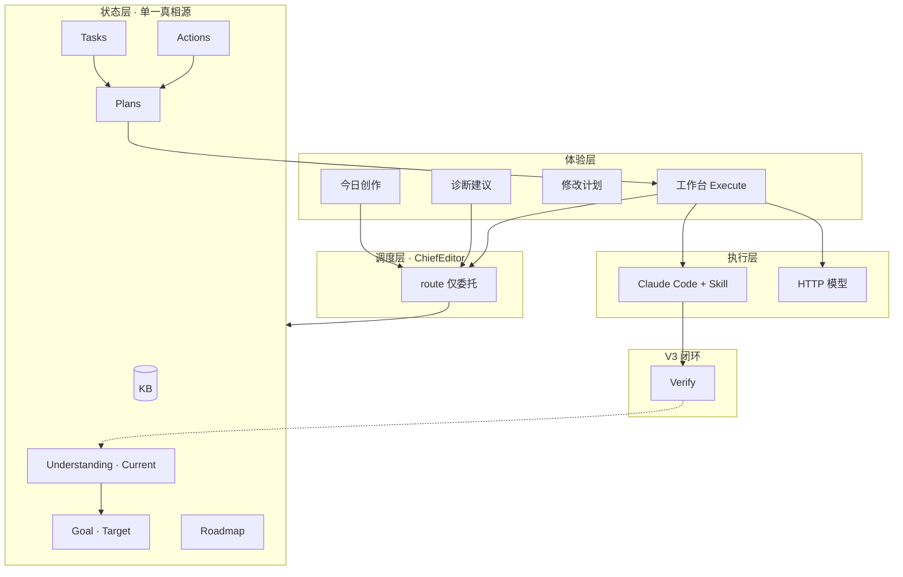

# 文匠 Studio · 架构与系统公约

> **版本**：Story OS Phase 1（V2.7.1）+ Creative Center 重构规划（**V2.8**）  
> **定位**：State-Driven Architecture（状态驱动），非 Prompt-Driven（提示词驱动）  
> **读者**：产品、工程、未来 V3 演进

---

## 一、架构评分与共识（2026-05）

| 维度 | 评分 | 说明 |
|------|------|------|
| 架构方向 | 9.3 / 10 | 已形成 Workspace → KB → … → Execute 状态链，避免纯 Agent 黑盒 |
| 产品方向 | 9.5 / 10 | 从分析工具升级为 Story OS（今日创作驱动）正确 |
| 可扩展性 | 8.5 / 10 | ChiefEditor、Scheduler 有职责膨胀苗头，需提前公约 |

**当前最大风险不是「做不出来」，而是职责重叠与未来复杂度膨胀。**

---

## 二、核心流水线（当前实现）

```text
Workspace（正文 / 大纲 / 设定）
    ↓ 扫描
Story KB（结构化事实）
    ↓ 分析
Understanding（作品分析 · Current State 候选）
    ↓ 只读
Story Goal（创作目标 · Target State）
    ↓
Chapter Roadmap（后续章节）
    ↓
Tasks（今日创作 · 做什么）
    ↓
Plans（修改计划 · 怎么做）
    ↓
Execution（Claude Code + Skill / HTTP 模型）
```

**并行诊断链（V2.6，不替代 Story OS）：**

```text
Understanding → Actions（诊断建议 · 为什么）→ Plans → Execute
```

**执行层不变：** 真正读写文稿、写章、改稿仍由 AI Runtime + 默认 Skill（如 literary-writer）完成。  
**规划层 Phase 1：** Goal / Roadmap / Tasks 为 heuristic（`manifest.source: "heuristic"`），尚未启用 Claude Planner。

---

## 三、系统公约（必须遵守）

以下四条为 **V2.8 / V3 不可违背的边界**。新功能评审前先对照此节。

### 公约 1 · Current State ≠ Target State

| 层 | 角色 | 回答的问题 | 真相源 |
|----|------|------------|--------|
| **Understanding** | Current State | 故事**正在**讲什么、结构现状如何 | `story_dna`、`arcs`、`conflicts` 等 |
| **Goal** | Target State | 故事**应该**往哪走 | `story_goal.current_state`（对 Current 的摘要引用）、`target_state`、`major_changes` |

**规则：**

- Understanding **拥有**「作品现在什么样」；Goal **只拥有未来**（`target_state`、`success_criteria`），**不拥有** `current_state` 真相。
- Goal 必须使用 `current_state_ref` → `understanding/story_dna.json`（代码已实现）；`current_state` 字段 **deprecated**，仅 UI 只读摘要 `current_state_summary`。
- `story_dna.one_liner` 与任何 Goal 内现状描述冲突时，以 **Understanding 为准**。
- 未来字段演进方向：

```text
Understanding  →  Current State（作品分析）
Goal           →  Target State（创作目标）
逻辑恒成立：Current → Target → Roadmap
```

### 公约 2 · Action → Task → Plan（为什么 → 做什么 → 怎么做）

严格定义三类对象，**禁止混用名词**：

| 对象 | 回答 | 示例 | 来源 |
|------|------|------|------|
| **Action** | **为什么做** | `diagnosis: "成长线在第 12 章后断裂"` | Understanding / 诊断引擎 |
| **Task** | **做什么** | `title: "撰写第 101 章"` | Roadmap 分解 / Story OS |
| **Plan** | **怎么做** | `steps[]`、`execution_prompt` | Task 或 Action 实例化 |

**链条：**

```text
Action（为什么）→ 可选生成 Task 或 Plan
Task（做什么）  → 必须能实例化为 Plan
Plan（怎么做）  → Execute
```

**与现有模块映射：**

- `actions/actions.json` → **Action**（诊断 Tab）
- `tasks/tasks.json` → **Task**（今日创作 Tab）
- `plans/*.json` → **Plan**（修改计划页 + 工作台执行）

**禁止：** Task 内嵌完整 execution 步骤（属于 Plan）；Action 直接 Execute（必须经过 Plan 确认，除非用户显式「一键执行」且审计可追溯）。

### 公约 4 · Knowledge 是唯一可编辑的故事事实源（Story Assets）

**用户可编辑的真相源只有两类叙事数据：**

1. **Workspace** — 正文、大纲、设定集 Markdown（创作原文）
2. **Knowledge** — `knowledge/*.json` 实体（角色、地点、关系、时间线、伏笔等）

**派生层（禁止 UI 直接编辑 JSON；禁止 Planner 静默覆写）：**

| 派生层 | 模块/路径 | 用户如何影响 |
|--------|-----------|--------------|
| **story-kb**（管道） | `story-kb/*` 代码 | 不是存储层；用户只见「知识库」 |
| **Story Index** | 内存 | Knowledge 变更后自动重建 |
| **Understanding** | `understanding/` | 触发 `POST /story/sync`，不手改文件 |
| **Goal / Roadmap / Tasks** | `planner/`、`tasks/` | 改 `preferences` 或 regen；不手改队列（V3 可审计编辑） |
| **Actions** | `actions/` | 采纳 → Plan |
| **Health / Verify** | `verify/` → `health/` | 「重新体检」 |
| **Memory / Vectors** | session、`data/memory/` | 清空会话 / 重建索引 |
| **Planner Context** | 运行时 prompt 块 | 不落盘为真相源 |

**硬规则：**

- **story-kb 是构建/索引管道，不是用户可见层**（对用户统一称 Knowledge / 知识库）。
- Planner、Understanding Engine、Verify **不得**在无用户确认下覆盖 `source=user` 的 Knowledge 实体。
- 合并优先级：用户 PUT Knowledge > pipeline `inferred` > Understanding 分析结论。

详见 [v2.8-data-boundaries.md](./archive/v2.8/v2.8-data-boundaries.md) 主矩阵。

### 公约 4b · Knowledge 只存 Story Assets，不存 Story Intelligence（V2.8.1 目标）

**事实（用户可编辑）** → `knowledge/entities/`（角色、地点、组织、关系）+ `knowledge/notes/`（用户备注、导入摘要）

**推断（引擎产出，不可当事实编辑）** → `understanding/`：伏笔、悬念、冲突、弧光、主题、story_dna

| 现 `knowledge/*.json` | 目标 |
|---------------------|------|
| characters, locations, relationships | `entities/` |
| foreshadows | **迁出** → `understanding/foreshadows.json` |
| story_summary（推断型 logline） | **迁出** 或降为 `notes/imported_summary` |

**禁止** 在 Knowledge 中累积「推断结论」，否则 Knowledge 沦为第二套 Understanding。详见 data-boundaries §Knowledge 拆分。

### 公约 5 · Prompt Context 不是持久化真相源

```text
Context 可以重建。
Truth 不可以重建。
```

| 允许落盘 | 禁止作为「设定真相」落盘 |
|----------|-------------------------|
| Workspace、Knowledge entities、Plans、measurement/* | planner_context.json、agent_state.json、runtime_memory.json |

**Planner Context**、Orchestrator 注入块、Director 会话摘要：**运行时拼装**，可从 Workspace + Knowledge + Understanding + measurement 只读重建。

未来 **Story Director / Autonomous Agent** 调整目标时只写 `planner/story_goal.json` 的 `target_state` / `success_criteria`，不写 Context 文件。

### 公约 6 · Entity Identity（id 不可变，name 可变）

Knowledge 实体（角色、地点、组织等）：

- **`id`**：创建时生成 `char_*` / `loc_*` / `org_*`，**永不因改名而改变**
- **`name`**：显示名，可改；旧名进入 **`aliases`**
- **引用**：Relationships、Actions、Understanding 扩展字段一律用 **id**，禁止用 name 作外键
- **合并**：`merged_into` + `status: merged`；**删除**：`status: deleted`（禁止硬删）

现状 `id === name` 为 **LEGACY**；Phase C 迁移须重分配 id。详见 [v2.8-entity-identity.md](./archive/v2.8/v2.8-entity-identity.md)。

### 公约 3 · Scheduler 只装箱，不决策

| 组件 | 允许 | 禁止 |
|------|------|------|
| **Planner** | 生成 Goal、Roadmap、**完整 Task 队列及优先级** | 替用户决定「今天写不写第 101 章」以外的语义裁剪 |
| **Scheduler** | 在 `daily_capacity_minutes` 内**选取** Planner 已排好序的 Task 子集 | 重排章节顺序、改写 Task 类型、丢弃 Planner 认定的「下一章」 |

**Phase 1 现状与偏差：**

- `getNextTask` 已优先取「章节号最小的待办 write_chapter」——符合「Planner 决策、Scheduler 选取」。
- `scheduleTodayTasks` 按 priority + capacity 装箱——允许；但若未来出现「Planner 定 101 章、Scheduler 改选 103 章」则违反公约，需在 Planner 输出中显式标记 `next_mandatory_task_id`，Scheduler 不得跳过。

**目标行为：**

```text
Planner 输出：[101 写章, 101 弧光, 102 写章, …]
Scheduler 输出：今日 [101 写章]（容量不够则截断，不重排）
```

---

## 四、危险信号与演进对策

### 4.1 Goal ↔ Understanding 边界模糊

**风险：** 双真相源（DNA vs Goal 都在描述「故事在讲什么」）。  
**对策：** 见公约 1；V2.8 重构 Goal schema，增加 `current_state_ref` 指向 Understanding  artifact。

### 4.2 Task / Plan / Action 三体问题

**风险：** 开发与用户认知混乱。  
**对策：** 见公约 2；API 与 UI 文案统一用用户词（见第六节）。

### 4.3 Scheduler 变第二个 Planner

**风险：** Planner 与 Scheduler 决策冲突。  
**对策：** 见公约 3；V2.8 将 priority 排序移入 `roadmap-builder` / `decomposer`，Scheduler 只读已排序队列。

### 4.4 ChiefEditor 变胖

**现状：** `routeRequest` 含 plan_today / plan_next / rewrite / write / plan_execute / chat 等。  
**目标结构（V2.8+，ChiefEditor 只做 route）：**

```text
agents/
├── chief-editor/      # 仅 route() + 上下文注入，无业务逻辑
├── planner-agent/     # Story OS 生成与重建
├── execution-agent/   # Plan 确认、写章、改稿执行契约
└── diagnosis-agent/   # Actions、Understanding 触发
```

**原则：** ChiefEditor 不超过「意图 → 委托哪个 agent」；单个 switch 分支只做 delegation。

### 4.5 缺失 Verify 层（V3）

**V2.8.1 已实现 MVP：**

```text
Execute → runQuickSync → Verify → verify_log + health_snapshot
         ↓ pass/partial → 自动标记关联 Task 为 done
```

| 触发点 | 验收 |
|--------|------|
| `completePlan` | `verifyPlanExecution` |
| `WRITE_FINISHED` | `verifyWriteChapter` |
| `POST /tasks/:id/complete` | `verifyAndCompleteTask` |

数据：`data/projects/{id}/verify/verify_log.json`、`health_snapshot.json`  
API：`GET /story/health`（含 verify 聚合）、`GET /story/verify`

**V3 待深化：** LLM 语义验收、Story Director 自动编排。

**V2.9 已实现：**

- Execute 前 `captureExecutionBaseline`（Understanding 指标快照）
- Verify 时对比 arc/conflict 缺口变化
- `fail` / `partial` 自动追加 `actions.json` 诊断建议（`source: verify`）

---

## 五、分层架构图



---

## 六、用户语言 vs 系统语言

**作者只关心：** 今天写什么 · 下一章写什么 · 哪里有问题 · 帮我改。

| 系统名 | 用户可见名 | 内部路径/模块 |
|--------|------------|---------------|
| Story Goal | 创作目标 | `planner/story_goal.json` |
| Roadmap | 后续章节 | `planner/chapter_roadmap.json` |
| Tasks | 今日创作 | `tasks/tasks.json` |
| Actions | 诊断建议 | `actions/actions.json` |
| Plans | 修改计划 | `plans/*.json` |
| Understanding | 作品分析 | `understanding/` |
| Story DNA | 作品画像 | `understanding/story_dna.json` |
| Story OS | （不暴露） | 产品统称「今日创作」 |
| ChiefEditor | （不暴露） | 后台路由 |

**前端规范：** Story 子导航与 Toast 禁止出现 DNA、Roadmap、Task ID 等开发术语（调试面板除外）。

---

## 七、数据目录（单项目）

```text
data/projects/{id}/
├── workspace/           # Claude cwd · 文稿真相源
├── knowledge/           # KB · 可编辑事实
├── understanding/       # Current State
├── actions/             # Action · 为什么
├── planner/             # Target + Roadmap + preferences
├── tasks/               # Task · 做什么
└── plans/               # Plan · 怎么做
```

---

## 八、执行运行时（不变）

```text
Orchestrator
  ├── ChiefEditor 路由结果 → 短路（tasks_today / write / task_execute / planner_result）
  └── 否则 → streamChat / streamWriteChapter
        ├── Claude Code CLI（Read/Write workspace）
        └── HTTP API（注入 excerpt，服务端落盘）
        └── 默认 Skill 块（literary-writer / webnovel-write）
```

Story OS **不替代** Skill；Skill 仍是 Execute 阶段的专业流程说明书。

---

## 九、版本路线图

| 版本 | 重点 | 架构约束 |
|------|------|----------|
| **V2.7.1** ✅ | Story OS Phase 1：Goal/Roadmap/Tasks/Scheduler | heuristic Planner；公约 1–3 文档化 |
| **V2.8** ✅ / 🚧 | Schema：`current_state_ref`、`planner_order`、agents 拆分；**Creative Center 运营层收敛** | conventions.js；§十二 + `archive/v2.8/roadmap-v2.8-creative-center.md` |
| **V2.8.1** ✅ | **Verify MVP** — Execute 后验收、health 聚合 | `story-verify/` |
| **V2.9** ✅ | 指标前后对比 + 验收失败写回 Actions | `metrics.js`, `action-followup.js` |
| **V3.0** | LLM 验收；Story Director | |

> **V2.8 创作中心**：与 schema/agents 条目并行推进；以 roadmap 分阶段交付，**禁止**在未收敛架构前改 Studio 页面布局。

---

## 十、PR / 设计评审检查清单

新增功能合并前，确认：

- [ ] 是否引入第二个「故事现状」真相源？（违反公约 1）
- [ ] 新对象是 Action、Task 还是 Plan？是否越界？（违反公约 2）
- [ ] Scheduler 是否做了排序/类型/章节决策？（违反公约 3）
- [ ] ChiefEditor 是否新增业务逻辑而非委托？（违反 4.4）
- [ ] Execute 后是否有验收路径或明确标注「无 Verify」？（V3 前可标注 tech debt）
- [ ] UI 是否暴露内部术语？（违反第六节）
- [ ] 是否在 Creative Center 新增素材/审稿并列入口？（违反 §十二，应归 Knowledge / health）
- [ ] 实施顺序是否跳过「数据/API」直接改 Studio 页面？（违反 §12.4）
- [ ] 是否新增用户可编辑的第三套设定/角色存储？（违反公约 4）
- [ ] Planner/Agent 是否静默写回 `knowledge/*.json`？（违反公约 4）
- [ ] 是否在 `health/` 下新增持久化 JSON？（违反 measurement 专篇，应走 `measurement/*`）
- [ ] 是否新增可编辑的 `context.json` / `agent_state.json`？（违反公约 5）

---

## 十二、产品分层与 Creative Center（V2.8 Target Architecture）

> **权威细节**：[v2.8-creative-cockpit-architecture.md](./archive/v2.8/v2.8-creative-cockpit-architecture.md)  
> **实施顺序**：目标架构 → 数据边界（P3）→ 一次性迁移（P4）→ UI（P5）。**禁止**在未锁定目标架构前写 `migrate*`。

### 12.1 四层模型

| 层 | 职责 | 入口 |
|----|------|------|
| **Workspace** | 创造内容：正文、大纲、AI 对话、计划执行 | `/projects/:id` |
| **Story OS** | 推进内容：Goal、Roadmap、Tasks、Plans、Actions、**Health** | 项目子导航 |
| **Creative Cockpit** | 监控内容：跨项目健康度、进度、产能、路线（Dashboard） | `/studio` |
| **Story Assets** | 管理资产：角色、地点、组织、设定、时间线、关系 | `/projects/:id/knowledge` |

```text
Workspace      → 写
Story OS       → 推（Health 内含 Review Engine，Actions 为诊断输出）
Cockpit        → 看（全局）
Story Assets   → 管（Knowledge，非 studio.assets）
```

### 12.2 Creative Center 最终形态（仅两项）

全局 **创作管理中心** `/studio` 只保留：

| Tab | 职责 |
|-----|------|
| **创作驾驶舱** | 总字数/项目数/近 7 日产能、活跃作品、待完成 Task、健康度摘要（链到项目 Health） |
| **项目版本** | 快照、Diff、恢复、历史 |

**不**在 `/studio` 保留：素材中心、审稿中心、独立「作品体检」Tab。

### 12.3 能力迁出

| 旧 Studio 能力 | 归宿 |
|----------------|------|
| 素材中心 | **Knowledge**（Story Assets） |
| 审稿中心 | **Health** → Review Engine → Actions |
| 写作看板四指标 | 并入 **Cockpit** 监控区块（统计可折叠） |

审稿不是独立中心：`重新体检` 在项目 Health；Cockpit 只展示跨项目分数摘要。

### 12.4 数据与实施（摘要）

- **P3 前**：不写迁移脚本；`studio.json` 的 assets/review 冻结新写入。
- **真相源（迁移后）**：`knowledge/*`、`health/*`、`versions/`；`story-kb` 仅为 KB 管道。
- **启发式审稿**：`analyzeProjectReview` 迁入 Review Engine，由 Health 暴露。

路线图：[roadmap-v2.8-creative-center.md](./archive/v2.8/roadmap-v2.8-creative-center.md)（P2=目标架构 ✅，P3 数据边界，P4 迁移，P5 UI）。

---

## 十一、相关文档

- [README.md](../README.md) — 启动与功能概览
- [v2.8-creative-cockpit-architecture.md](./archive/v2.8/v2.8-creative-cockpit-architecture.md) — **Creative Center 目标架构（权威）**
- [v2.8-data-boundaries.md](./archive/v2.8/v2.8-data-boundaries.md) — **P3 数据边界白皮书（权威）**
- [v2.8-measurement-layer.md](./archive/v2.8/v2.8-measurement-layer.md) — **Measurement Layer（Review/Verify/Health 关系）**
- [v2.8-entity-identity.md](./archive/v2.8/v2.8-entity-identity.md) — **Entity Identity Law（Phase C 前门）**
- [v2.8-legacy-inventory.md](./archive/v2.8/v2.8-legacy-inventory.md) — **Legacy Inventory（现实审计）**
- [v2.8-migration-design.md](./archive/v2.8/v2.8-migration-design.md) — **Migration Design（Phase C / Dry Run 依据）**
- [roadmap-v2.8-creative-center.md](./archive/v2.8/roadmap-v2.8-creative-center.md) — 分阶段实施路线图（归档）
- [project-architecture.json](./project-architecture.json) — 模块与目录机器可读描述

**维护：** 架构变更须更新本节「系统公约」、§十二 与版本路线图，而非仅在 PR 描述中口头约定。
