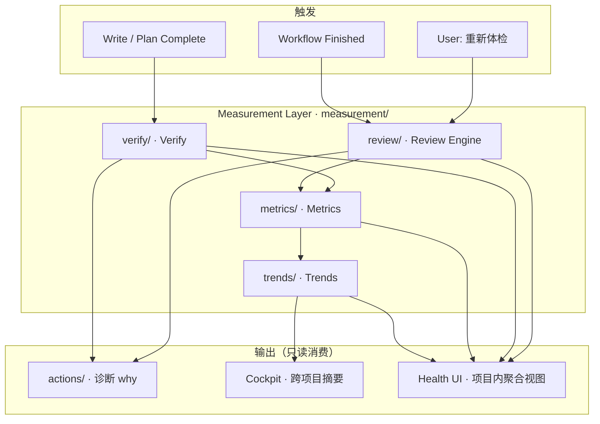

# V2.8 · Measurement Layer（测量层专篇）

> **状态**：架构定稿 — 解决 Review / Verify / Metrics / Trend / **Health（UI 名）** 五者关系。  
> **风险等级**：当前 V2.8 **最高**潜在复杂度来源（高于 Studio UI 重构）。  
> **关联**：[v2.8-data-boundaries.md](./v2.8-data-boundaries.md) · [architecture.md](../../architecture.md)

---

## 一、核心结论（先读）

| 名词 | 是什么 | 不是什么 |
|------|--------|----------|
| **Measurement Layer** | 持久化测量数据的**存储层**（目录 `measurement/`） | 不是 Story OS 子产品 |
| **Review Engine** | 启发式检测器（节奏/人物/伏笔/风格…） | 不是 IDE、不是独立中心 |
| **Verify** | 执行后验收（写章/Plan/Task 是否达成目标） | 不是审稿 |
| **Metrics** | 可对比的数值指标（Understanding 前后、章节维度分） | 不是 Goal |
| **Trends** | 时间序列（分数/通过率/停更风险） | 不是 Roadmap |
| **Health** | **UI 聚合视图名** + API 响应形状 | **不是**存储根目录名 |

```text
禁止：health/ 目录塞满 review、verify、alerts、recommendations …
      → 半年后 Health = 第二个 Story OS

正确：measurement/{review,verify,metrics,trends}/
      Health 页面 / GET …/health = 只读聚合，不写新真相源
```

---

## 二、五者关系（一张图）



**数据流一句话：**

```text
Review 检测「写得怎么样」→ Metrics 记分 → Trends 记历史
Verify 检测「做完没有」→ 写入 verify log → 可能生成 Actions
Health 页面 = 把上面四块拼给用户看，自己不拥有新事实
```

---

## 三、组件定义

### 3.1 Review Engine（检测器）

| 项 | 说明 |
|----|------|
| **职责** | 对当前正文做启发式分析（非 LLM 主路径） |
| **现状** | `studio-service.analyzeProjectReview` |
| **目标路径** | `measurement/review/latest.json` + 可选 `measurement/review/history/` |
| **输入** | workspace 最新章、Knowledge **entities**（只读）、大纲是否存在 |
| **输出** | 五维 score、hints、diagnostics 片段 |
| **用户操作** | 项目 Health 页：**重新体检**（禁止「运行审稿分析」独立产品文案） |
| **与 Actions** | hints 可 **建议** 生成 Action；Engine **不**直接改 Knowledge / Understanding |

**禁止：** `/studio` 独立审稿 Tab；`studio.review_by_project` 长期双写。

### 3.2 Verify（验收器）

| 项 | 说明 |
|----|------|
| **职责** | Execute 之后：写章/完成 Plan/完成任务是否满足约定 |
| **现状** | `story-verify/` → `verify/verify_log.json`、`health_snapshot.json` |
| **目标路径** | `measurement/verify/log.json`、`measurement/verify/snapshots/` |
| **输入** | Plan 步骤、Task、正文、Understanding baseline（V2.9 指标对比） |
| **输出** | pass / partial / fail、message、可选 `created_action_id` |
| **用户操作** | 间接（完成 Task/Plan）；无单独「验收中心」 |

Verify **不**替代 Review：验收回答「做没做到」，审稿回答「写得好不好」。

### 3.3 Metrics（指标）

| 项 | 说明 |
|----|------|
| **职责** | 可比较的数值与维度分，供 Trends 与 Cockpit 使用 |
| **现状** | `quality/scorer.js` 章节六维；`story-verify/metrics.js` 理解层前后对比 |
| **目标路径** | `measurement/metrics/chapters.json`、`measurement/metrics/project.json` |
| **写入方** | Review Engine、Verify、scorer 刷新 |
| **读取方** | Trends 聚合、Health UI、Cockpit |

**与 Understanding 边界：** Metrics **读取** `understanding/*` 算缺口变化；**不得**把弧光/冲突结论写回 Knowledge。

### 3.4 Trends（趋势）

| 项 | 说明 |
|----|------|
| **职责** | 时间序列：分数变化、verify 通过率、停更天数 |
| **目标路径** | `measurement/trends/series.json`（或按维度拆分） |
| **写入方** | 每次 Review / Verify 完成后 append 一点 |
| **读取方** | Health UI 折线、Cockpit 风险卡片 |

Trends **不**存储叙事事实，只存储测量历史。

### 3.5 Health（UI 名 · 聚合视图）

| 项 | 说明 |
|----|------|
| **职责** | 项目内「作品质量 / 健康度」**展示层** |
| **现状** | `buildProjectHealthView` = scorer + verify bundle |
| **API** | 保留 `GET /projects/:id/story/health`（用户语言） |
| **实现** | **无** `health/` 存储根；服务端运行时聚合 `measurement/*` |
| **Cockpit** | 只读各项目 `measurement/metrics/project.json` 摘要 |

```text
Health ≠ 目录
Health = f(measurement.review, measurement.verify, measurement.metrics, measurement.trends)
```

---

## 四、目标目录结构（单项目）

```text
data/projects/{id}/

measurement/                    # Measurement Layer 唯一存储根
├── review/
│   ├── latest.json             # 最近一次体检（原 studio review + 启发式）
│   └── runs/                   # 可选历史 run_id
├── verify/
│   ├── log.json                # 原 verify_log.json
│   └── snapshots/              # 原 health_snapshot 类聚合
├── metrics/
│   ├── project.json            # 总体分、五维、kb_stats
│   └── chapters.json           # 按章维度分
└── trends/
    └── series.json             # 时间序列

actions/                        # Diagnosis · 消费 measurement 输出
understanding/                  # 不被 measurement 覆盖
knowledge/                      # 只被 review 只读
```

**过渡（Phase C）：** 双读 `verify/` 与 `measurement/verify/`；新写入只走 `measurement/`。

---

## 五、与 Story OS 三层的关系

```text
Story OS
├── Planner        Goal / Roadmap / Tasks
├── Diagnosis      Actions  ← 接收 review hints、verify fail
└── Measurement    measurement/  ← 本文

Health（UI）       横切 Measurement 的只读视图
Cockpit（UI）      横切 Measurement + Planner + Tasks 的只读视图
```

Measurement **不**生成 Task、**不**改 Roadmap、**不**写 Knowledge。  
最多 **建议** Action（与现 `action-followup` 一致）。

---

## 六、迁移映射（现状 → 目标）

| 现状 | 目标 | 备注 |
|------|------|------|
| `studio.json` `review_by_project` | `measurement/review/latest.json` | 迁移后 studio 停写 |
| `verify/verify_log.json` | `measurement/verify/log.json` | |
| `verify/health_snapshot.json` | `measurement/verify/snapshots/latest.json` | 改名，非 health/ 根 |
| `quality/scorer` 章节分 | `measurement/metrics/chapters.json` | |
| `GET …/health` 响应 | 聚合层，路径不变 | 用户语言保留「健康度」 |
| `POST …/health/review` | 触发 Review Engine | 写入 measurement/review |
| event `WORKFLOW_FINISHED` → `runStudioReview` | → Review Engine → measurement/review | 去掉 studio 缓存 |

---

## 七、反模式（Architecture Review 必查）

| 反模式 | 后果 |
|--------|------|
| 新建 `health/recommendations.json` | Health 变第二个 Story OS |
| Review 结果写入 `knowledge/foreshadows` | 推断与事实混写（见数据边界 §Knowledge 拆分） |
| Verify fail 直接改 Task 状态为 done | 违反验收语义 |
| Cockpit 写入 measurement | 运营层污染测量层 |
| `context.json` / `agent_state.json` 持久化 | 违反公约 5 |

---

## 八、与公约 4 / 5 的衔接

- **公约 4**：Measurement 产出 **不可编辑**；用户通过「重新体检」「重新同步」间接刷新。
- **公约 5**：Planner Context 不落盘；Measurement 的 **聚合 API** 同样运行时拼装，除非属于 `measurement/*` 四类持久化文件之一。

---

## 九、实施顺序（不跳步）

```text
1. 本文评审锁定（当前）
2. 更新 data-boundaries 矩阵：Health 行改为 measurement/*
3. Phase C 迁移：verify + studio review → measurement/（与 knowledge 迁移可同脚本，不同目录）
4. 重构 buildProjectHealthView → 读 measurement/*
5. UI：项目 Health 页文案统一「重新体检」；Cockpit 只读 metrics 摘要
```

**禁止：** 在锁定本文前把 `health/` 当作新存储根目录创建一堆 JSON。

---

## 十、Schema 闭合（Sprint 2B 定稿）

| 文件 | JSON Schema | 写入方 |
|------|-------------|--------|
| `measurement/review/latest.json` | [measurement-review-latest.schema.json](./schemas/measurement-review-latest.schema.json) | Review Engine |
| `measurement/verify/log.json` | [measurement-verify-log.schema.json](./schemas/measurement-verify-log.schema.json) | Verify（append） |
| `measurement/metrics/project.json` | [measurement-metrics-project.schema.json](./schemas/measurement-metrics-project.schema.json) | 聚合刷新 |
| `measurement/trends/series.json` | [measurement-trends-series.schema.json](./schemas/measurement-trends-series.schema.json) | 聚合 append |

运行时 normalize：`backend-node/measurement/schemas.js`

**废弃存储：** `verify/health_snapshot.json` — Phase C 后改为从 `metrics/project` + `verify/log` **运行时聚合**，不再单独双写快照文件。

---

## 十一、数据流定稿（Verify / Review → Metrics → Trends）

**已锁答案：** 两条事件链 **都先更新 Metrics（快照/rollup），再 append Trends（单点）**。  
**不是** Verify → Trend → Metrics，也 **不是** 只写 Health Snapshot。

### 11.1 Verify 链（执行验收）

```text
Execute 完成
    ↓
Verify Engine → verify_result（单条）
    ↓ append
measurement/verify/log.json
    ↓ rollup（重算）
measurement/metrics/project.json
    │   ├── overall_health（quality scorer）
    │   ├── verify_summary（pass/partial/fail 计数）
    │   └── last_verify_id（指针，非嵌入全文）
    ↓ append 一点
measurement/trends/series.json
    │   └── verify_pass_rate[at]
    ↓ 可选
Actions（fail/partial → diagnosis）
```

`health_snapshot` **不再**作为持久化中间层；Health UI = 读 metrics + 最近 verify 指针。

### 11.2 Review 链（重新体检）

```text
用户「重新体检」/ WORKFLOW_FINISHED
    ↓
Review Engine
    ↓ replace
measurement/review/latest.json
    ↓ merge 维度分
measurement/metrics/project.json
    │   └── review: { 节奏, 人物, 伏笔, 风格, … }
    ↓ append
measurement/trends/series.json
    │   └── review_pacing[at], review_character[at], …
```

Review **不** append 到 verify/log（事件类型不同）。

### 11.3 Health / Cockpit 读路径

```text
GET …/measurement/health
    = metrics/project
    + review/latest
    + verify/log.items[0]   （最近一条，非全量 log）

Cockpit 跨项目
    = 各项目 metrics/project.overall + trends 最近点
```

### 11.4 Phase C 迁移对照

| 现状 | 目标 |
|------|------|
| `verify/verify_log.json` | `measurement/verify/log.json`（schema 改名兼容读） |
| `verify/health_snapshot.json` | **删除写入**；由 rollup 代替 |
| `studio.review_by_project` | `measurement/review/latest.json` |
| `quality/scorer` 内存 | `measurement/metrics/project.json` 持久化 |

---

## 修订记录

| 日期 | 说明 |
|------|------|
| 2026-06-02 | 初稿：五者关系；measurement/ 存储根；Health = UI 聚合 |

**维护：** 新增测量类 JSON 必须先归入 review/verify/metrics/trends 之一，禁止新建 `health/*` 数据文件。
